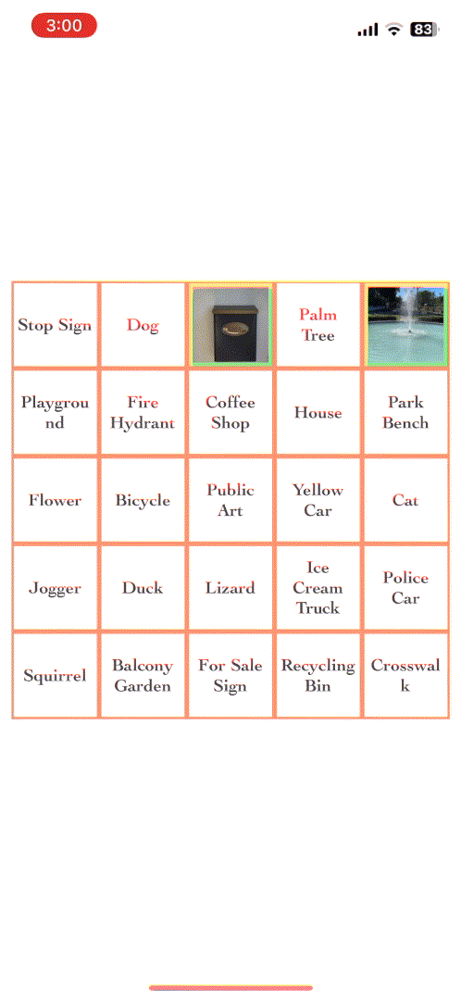

# BingoVisionApp

BingoVisionApp is a React Native mobile application that combines the fun of bingo with real-world object detection.

<p align="center">
  
</p>

## Getting Started

These instructions will get you a copy of the project up and running on your local machine for development and testing purposes.

### Prerequisites

- Git
- Node.js (>= 16)
- npm
- Xcode (for iOS development)
- Android Studio (for Android development)
- OpenAI API Key

### Installation

1. **Clone the repo**
   ```bash
   git clone https://github.com/P-Carth/Vision-Bingo.git
   ```

2. **Navigate to the project directory**
   ```bash
   cd BingoVisionApp
   ```

3. **Install dependencies**
   ```bash
   npm install
   ```
   
### Setting Up OpenAI API Key

1. **Obtain an API key from OpenAI**
   - Visit [OpenAI's website](https://openai.com/) and sign up to get an API key.

2. **Update the Gpt.js file**
   - Navigate to `BingoVisionApp/services/Gpt.js`.
   - Replace the placeholder text with your OpenAI API key:
     ```javascript
     const API_KEY = 'REPLACE_WITH_OPENAI_API_KEY';
     ```
     
### iOS Setup

1. **Open the project in Xcode**
   - Sign the project with your Apple Developer account for running it on a physical device or simulator.

2. **Install CocoaPods dependencies**
   - Navigate to the `ios` folder in your project directory and run:
     ```bash
     npx pod-install ios
     ```
   - This command installs all the CocoaPod dependencies defined in the `Podfile`.

3. **Run the project**
   ```bash
   npx react-native run-ios

### Android Setup -- `DISCLAIMER: Android has not been tested`

1. **Ensure Android Studio is installed**
   - Install necessary SDKs through Android Studio.

2. **Set up an Android Virtual Device (AVD) in Android Studio**

3. **Run the project**
   ```bash
   npx react-native run-android
   ```
   - This will build the app and launch it on a connected Android device or emulator.

## Authors

* **[Preston Kirschner](https://github.com/P-Carth)**

## License

This project is licensed under the MIT License
